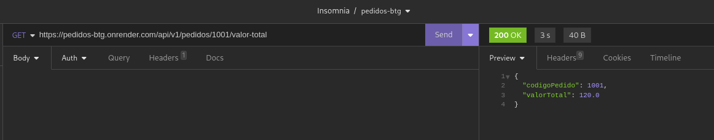

# Aplicação sobre pedidos e geração de relatórios

Esse foi um desafio técnico que consistia em desenvolver uma aplicação sobre pedidos. 
Onde os pedidos chegam via mensageira. Com esses dados, gerar informações analíticas:
- Valor total do pedido;
- Quantidade de Pedidos por cliente;
- Lista de pedidos realizados por cliente;

Houve uma dúvida se era um relatório com todas essas informações ou que seriam vários 
relatórios. O entendimento foi de que seriam vários relatórios. Outra decisão importante
foi a aplicação focar em resolver somente as questões de pedidos. A questões sobre 
cliente e produtos são questões secundárias e não tão revelantes para a aplicação.

## Atividades Planejadas:
1. Criar o ambiente inicial de desenvolvimento. Estimativa: 1 hora.
    - Configuração da IDE e do banco de dados em Docker; 
    - Estrutura inicial do projeto utilizando o [Spring Initializr](https://start.spring.io/);
    - Conferir a integração entre o serviço e o banco de dados;
    - Definições de design de código e arquitetura.
2. Criação dos endpoints. Estimativa: 5 horas.
   - Criação dos controllers dos recursos;
   - Repositório de dados;
   - Modelagem das entidades;
   - Testes manuais e automatizados.
3. Consumo dos pedidos por mensageira. Estimativa de 2 horas.
    - Configuração do rabbitmq no projeto e sua integração com o serviço;
    - Criação do consumidor/listener;
    - Testes manuais e automatizados.
4. Deploy da aplicação. Estimativa: 2 horas.
    - Verificar hospedagem para cada serviço;
    - Fazer um docker-compose dos serviços;
    - Deploy propriamente dito.
5. Documentação e teste manual da aplicação. Estimativa de 2 horas.
    - Geração desse documento;
    - Validações das funcionalidades;
    - Gerações de evidências;

Total de hora planejada: 12 horas.

## Observações sobre a execução

Alguns troubleshooting demandaram mais tempo, porque as mensagens de erro não eram
suficientes para entender o que estava acontecendo ou alguma questão no ambiente 
configuração não estavam de acordo. Lista de atividades que demandaram mais tempo:
- A atividade 3, essa aplicação foi meu primeiro com RabbitMQ e demorei para entender 
o funcionamento e configuração. Pelo menos mais 1 hora do planejado; 
- A atividade 4, um pequeno erro de configuração no docker-compose e hospedar os 
serviços, exigiu mais tempo. Pelo menos mais 3 horas do planejado.

Totalizando um total de 16 horas para a resolução desse desafio técnico, 4 mais do 
previsto.

## Tecnologias Utilizadas

- Java 21, Spring Boot, Spring Data, Spring AMQP, RabbitMQ, PostgreSQL, Maven, H2;
- Fedora Silverblue, Intellij, Docker, Insomnia, Bash, Markdown;
- [DockerHub](https://hub.docker.com/r/alenvieira/pedidos), [Render](https://render.com/), 
[CloudMQP](http://cloudamqp.com/).

## Arquitetura da aplicação

Como podemos ver na imagem acima, nossa aplicação tem 4 componentes:
- Nosso **Cliente** que tem capacidade de postar um pedido na fila e requisitar relatórios via API. 
- Um banco de dados **PostgreSQL** para gravar e armazenar as informações dos pedidos;
- Um **RabbitMQ** que disponibiliza uma fila para postagens de mensagens de pedidos;
- Nossa **Aplicação pedidos** para processar as mensagens de pedido e gerar os relatórios.

## Base de dados de pedidos

Por simplicação de escopo, criamos apenas duas tabelas:

A tabela pedido tem um index para o código de cliente porque é um atributo que vai ser bastante 
utilizado nas consultas. Uma questão de implementação é que o codigo_pedido não é incremental, 
realmente é utilizado sua chave natural que vem na mensagem do pedido, já o código do item é gerado 
incrementalmente não realizando validações que tem itens duplicados no pedido do cliente.

Como já tido, optou se por concentrar em pedidos. As informações de cliente ou produtos poderiam serem 
uma tabela a parte. Como não temos contexto geral, já podem existir essas tabelas ou serão criadas por 
outras aplicações causando um desencontro de informações.

## Infraestrutura da Solução

Vemos acima nossa infraestrutura em dois PaaS: [Render](https://render.com/) e o 
[CloudMQP](http://cloudamqp.com/) ambos tem bastante facilidade na criação dos
recursos e sem custos. No Render hospedamos a nossa Aplicação pedidos e o PostgreSQL. 
Na CloudAMQP temos nosso RabbitMQ.

Console da Render:

Consoleda CloudAMQP:

### Aplicação pedidos

No Render, é possível fazer o deploy da aplicação através de uma imagem docker para mais 
informações clique [aqui](https://docs.render.com/deploy-an-image). Então criamos nossa 
imagem e subimos para o [Docker Hub](https://hub.docker.com/r/alenvieira/pedidos/).

A instância da aplicação pode ficar inativa devido à inatividade, o que pode atrasar as 
solicitações em 50 segundos ou mais. Ela está hospedada em Oregon (US West) com 0.1 de 
CPU e 512 MB de memória RAM.

### PostgreSQL

Optou se criar uma instância PostgreSQL padrão no Render que tem limitações de tempo por ser
gratuito, então a instância expirará em 22 de julho de 2024 e o banco de dados será excluído.

A instância está hospedada em Oregon (US West) com 0.1 de CPU, 256 MB de memória RAM, 1 GB de
armazenamento e está na versão do PostgreSQL 16.

### RabbitMQ

A CloudMQP informa que a instância está hospedada na AWS Northern California (US-West-1). Com 
o plano gratuito Little Lemur é possível criar até 100 filas, com no máximo de 10.000 mensagens
na fila, máximo 20 conexões e 1 milhão de mensagens por mês.

## Evidência de Testes funcionais da aplicação

As requisições para a API estão no repositório na pasta doc no arquivo Insomnia_pedidos.yml e 
podendo ser importado em outro Insomnia.

### Postando uma mensagem na fila

### Consultando o valor de total de um pedido

### Consultando a quantidade de pedidos de um cliente

### Consultando pedidos de um cliente

## Melhorias observadas
- Ausência de uma CI/CD, é sempre bom ter algo automatizado para verificações da nossa
aplicação, como rodar os testes, verificar diversas regras pré-definidas, buscar vulnerabilidades
da aplicação, validar a qualidade do código e também para fazer o deploy automaticamente;
- Melhorar o monitoramento e a observabilidade da aplicação. Não há logs além do gerado 
automaticamente, criação de métricas específicas de regra de negócio e do estado da aplicação;
- Tratar mais sobre mensageira, sobre os possíveis erros. Decisões sobre DLQ, tempo de processamento
da mensagem consumida, retentativas;
- Aprimorar as exceções, principalmente na parte de mensageira. Acredito que tenho espaço para
melhorias. Também poderia fazer execeções personalizadas para alguns cenários;
- Mais testes é sempre bom. Testar automatizado cenários mais reais utilizando um RabbitMQ de fato 
para ver cenários de json mal formatados ou verificar se há diferenças em testar um PostgreSQL invés 
de um H2;
- Há oportunidade de documentar tanto a APi através do Swagger ou mesmo da mensageira com o AsyncAPI 
e também documentar pequenas rotinas como criar a imagem e mandar para o docker hub;
- Várias configurações(application.properties ou application.ym) a nível de banco de dados, spring, 
mensagens de erros, servidor de aplicação(tomcat) podem ser melhoradas.
- Utilizar o tipo double para preço não foi a melhor abordagem porque isso pode causar alguma imprecisão 
quando realizando cálculos.
- A fila no RabbitMQ que é de responsabilidade da aplicação, mas o nome da fila está hardcode o que não permitiria mudar de fila
sem fazer outro deploy. O ideal é transformar em variável de ambiente.